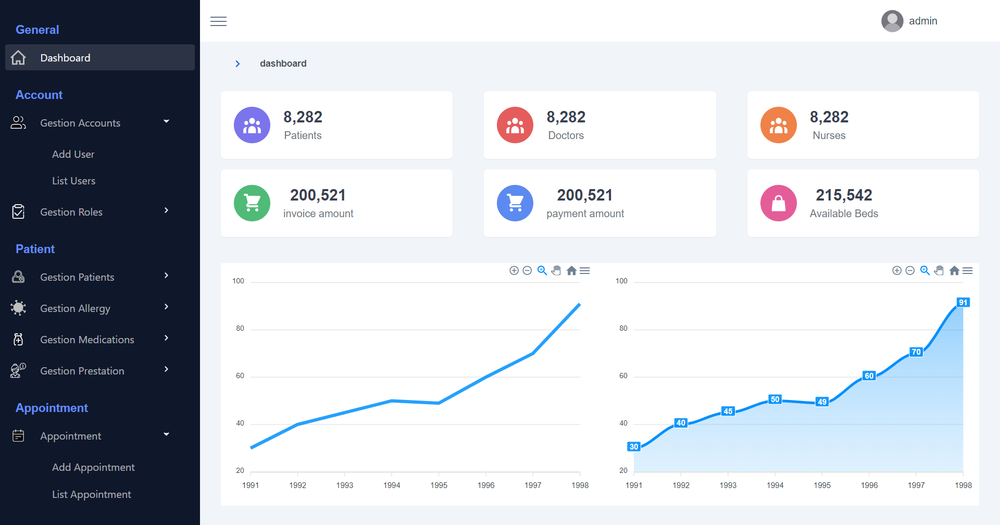
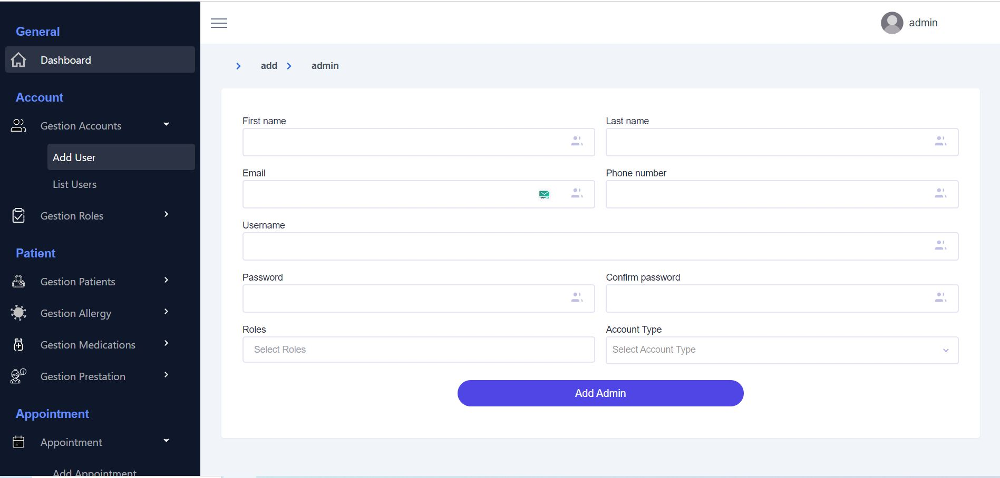
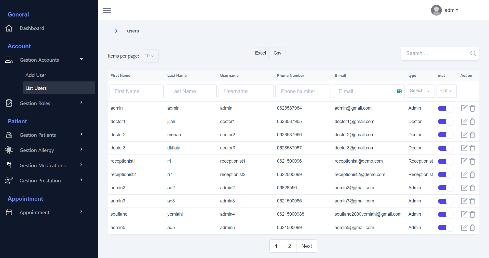
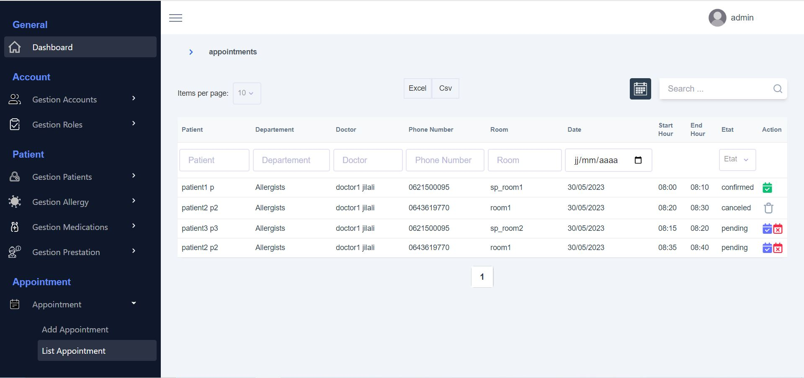
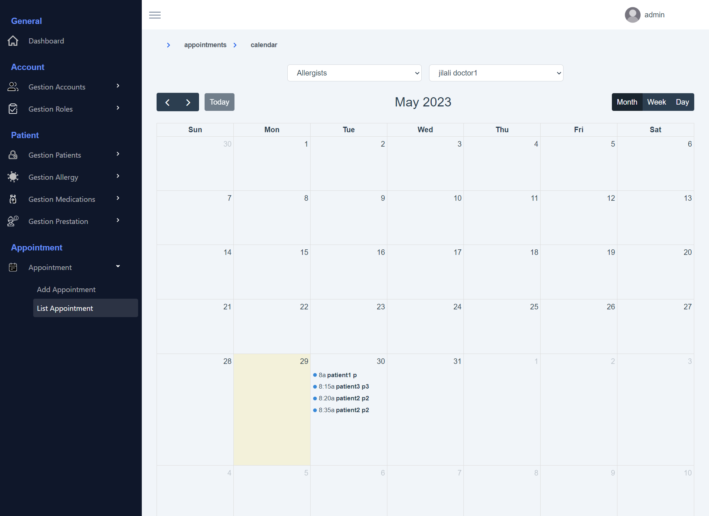

# first-app

## Project setup
```
npm install
```

### Compiles and hot-reloads for development
```
npm run serve
```

### Compiles and minifies for production
```
npm run build
```

### Lints and fixes files
```
npm run lint
```

### Customize configuration
See [Configuration Reference](https://cli.vuejs.org/config/).

### screens of my app 
#### 1) dashboard screen


#### 2) add new user 


#### 3)  users list


#### 4) list appointments


#### 5)  calendar  appointments



